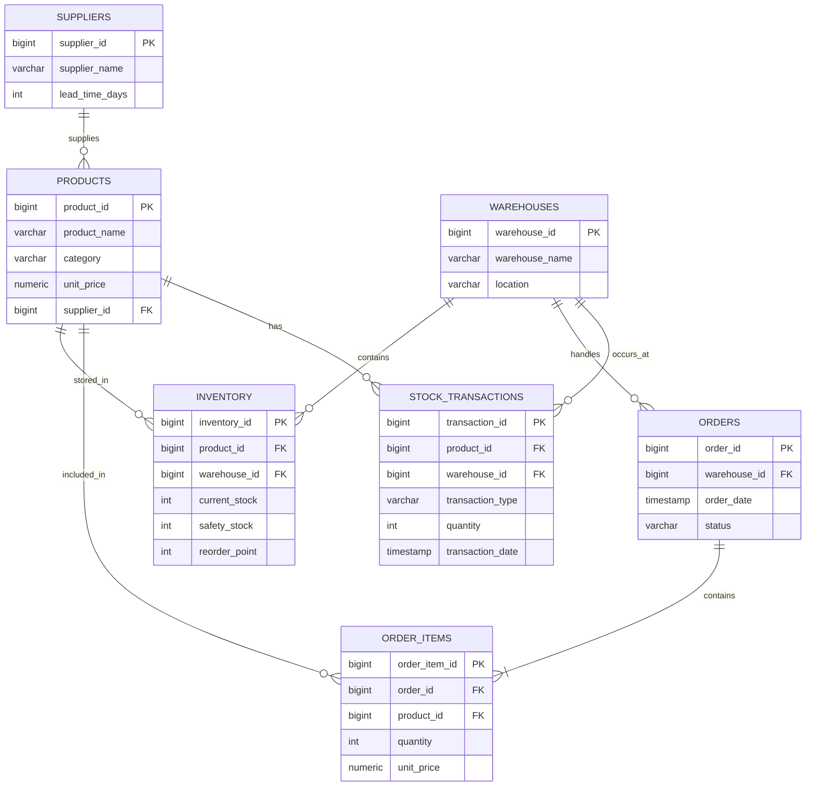

# Entity Relationship Diagram

```mermaid
erDiagram

    SUPPLIERS ||--o{ PRODUCTS : supplies
    PRODUCTS ||--o{ INVENTORY : stored_in
    WAREHOUSES ||--o{ INVENTORY : contains
    WAREHOUSES ||--o{ ORDERS : handles
    ORDERS ||--|{ ORDER_ITEMS : contains
    PRODUCTS ||--o{ ORDER_ITEMS : included_in
    PRODUCTS ||--o{ STOCK_TRANSACTIONS : has
    WAREHOUSES ||--o{ STOCK_TRANSACTIONS : occurs_at

    SUPPLIERS {
        bigint supplier_id PK
        varchar supplier_name
        int lead_time_days
    }

    PRODUCTS {
        bigint product_id PK
        varchar product_name
        varchar category
        numeric unit_price
        bigint supplier_id FK
    }

    WAREHOUSES {
        bigint warehouse_id PK
        varchar warehouse_name
        varchar location
    }

    INVENTORY {
        bigint inventory_id PK
        bigint product_id FK
        bigint warehouse_id FK
        int current_stock
        int safety_stock
        int reorder_point
    }

    ORDERS {
        bigint order_id PK
        bigint warehouse_id FK
        timestamp order_date
        varchar status
    }

    ORDER_ITEMS {
        bigint order_item_id PK
        bigint order_id FK
        bigint product_id FK
        int quantity
        numeric unit_price
    }

    STOCK_TRANSACTIONS {
        bigint transaction_id PK
        bigint product_id FK
        bigint warehouse_id FK
        varchar transaction_type
        int quantity
        timestamp transaction_date
    }
```